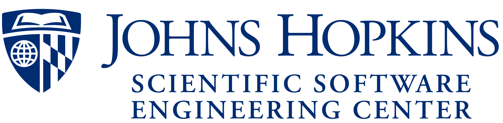

<p>
  
  &nbsp;&nbsp;&nbsp;&nbsp;&nbsp;&nbsp;
  
</p>

# Introduction to Dash

This repository contains documentation, resources, and code for the **Introduction to Dash** session
designed and delivered at the ICCS Summer School.
All materials, including slides and exercises, are available such that individuals can cover the
course in their own time.

A website for this workshop can be found at [ICCS Summer School 2026](https://iccs.cam.ac.uk/events/institute-computing-climate-science-annual-summer-school-2026).


## Contents

- [Learning Objectives](#learning-objectives)
- [Teaching material](#teaching-material)
- [External Links](#external-links)
- [Preparation and prerequisites](#preparation-and-prerequisites)
- [Installation and setup](#installation-and-setup)
- [License information](#license)
- [Contribution Guidelines and Support](#contribution-guidelines-and-support)


## Learning Objectives

The key learning objective from this workshop is to
_provide participants with the skills to build interactive web-based dashboards using Plotly Dash_.

Specifically, by the end of this session you will be able to:

* Understand the architecture of a Dash application (layout + callbacks)
* Build layouts using Dash HTML and Core Components
* Create interactive callbacks that respond to user input
* Integrate Plotly figures into a Dash app
* Structure a multi-component dashboard for exploring data

## Teaching Material

### Slides
The slides for this workshop will be made available here after the session.

### Exercises
The exercises for the course can be found in the [exercises](exercises/) directory.  
These take the form of partially completed Python scripts that you will extend during the session.


## External Links

- [Dash User Guide](https://dash.plotly.com/)
- [Dash in 20 Minutes Tutorial](https://dash.plotly.com/tutorial)
- [Charming Data](https://www.youtube.com/@CharmingData) — great videos to help you with more advanced Dash 


## Preparation and prerequisites

### Prerequisites

To get the most out of the session we assume:

- Basic familiarity with Python (running scripts, installing packages, using functions)
- The ability to use a terminal/command line
- Familiarity with `git clone` to obtain the repository — if you are new to Git, the
  [ICCS Summer School Git intro](https://www.youtube.com/watch?v=ZrwzK4CnJ3Q) provides the necessary background.


### Preparation

Please ensure the following are available on your machine before the session:

- [Python 3.9+](https://www.python.org/downloads/)
- A terminal emulator (Terminal on macOS, Windows Terminal, or your IDE's integrated terminal)
- One of:
  - A text editor or IDE such as [VS Code](https://code.visualstudio.com/) (recommended) or [PyCharm](https://www.jetbrains.com/pycharm/)
  - Or any editor you are comfortable running Python scripts from

If you require assistance with any of these please reach out to us before the session.


## Installation and setup

### 1. Clone the repository

```bash
git clone https://github.com/Cambridge-ICCS/Intro-to-Dash-ICCS-SummerSchool.git
cd Intro-to-Dash-ICCS-SummerSchool
```

### 2. Create a Python virtual environment

#### Option A — Using the terminal (venv)

```bash
python3 -m venv venv
source venv/bin/activate   # On Windows: venv\Scripts\activate
pip install -r requirements.txt
```

#### Option B — Using VS Code

1. Open the cloned folder in VS Code.
2. Press `Ctrl+Shift+P` (or `Cmd+Shift+P` on macOS) and select **Python: Create Environment**.
3. Choose **Venv**, select your Python 3.9+ interpreter, and tick `requirements.txt` when prompted.
4. VS Code will create the environment and install dependencies automatically.

### 3. Quickstart — verify Dash works

Run the first exercise file [`exercises/00_hello_dash.py`](exercises/00_hello_dash.py) to confirm everything is working:

```bash
python3 exercises/00_hello_dash.py
```

Open your browser at [http://127.0.0.1:8050](http://127.0.0.1:8050).  
If you see **"Hello Dash"** on the page, you're all set. Press `Ctrl+C` in the terminal to stop the server.


## License

The code materials in this project are licensed under the [MIT License](LICENSE).


## Contribution Guidelines and Support

If you spot an issue with the materials please let us know by
[opening an issue](https://github.com/Cambridge-ICCS/Intro-to-Dash-ICCS-SummerSchool/issues)
here on GitHub clearly describing the problem.

If you are able to fix an issue that you spot, or an
[existing open issue](https://github.com/Cambridge-ICCS/Intro-to-Dash-ICCS-SummerSchool/issues)
please get in touch by commenting on the issue thread.

Contributions from the community are welcome.
To contribute back to the repository please first
[fork it](https://github.com/Cambridge-ICCS/Intro-to-Dash-ICCS-SummerSchool/fork),
make the necessary changes to fix the problem, and then open a pull request back to
this repository clearly describing the changes you have made.
We will then perform a review and merge once ready.

If you would like support using these materials, adapting them to your needs, or
delivering them please get in touch either via GitHub or via
[ICCS](https://github.com/Cambridge-ICCS).
